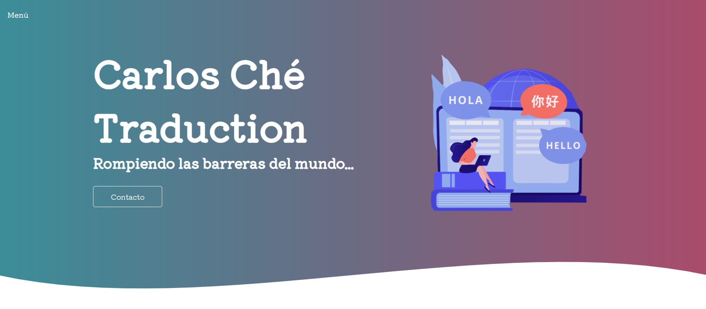
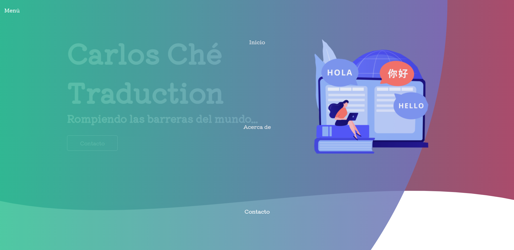
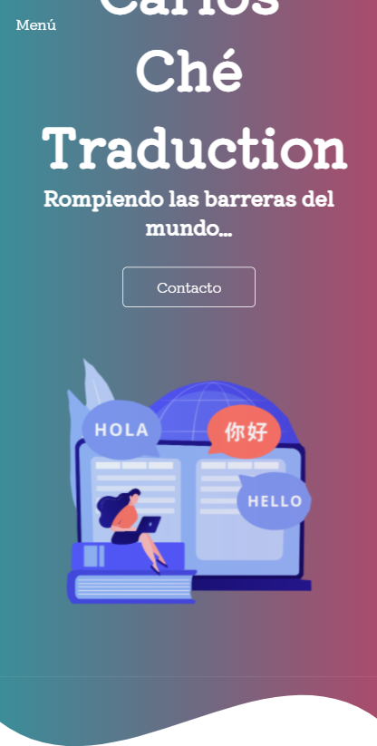

# Landing Page, para servicios de traductor
Esta es la primer version se la landing page de los servicios de traductor, las herramientas utilizadas se listan abajo

## Herramientas utilizadas
* **Freepik.**
    Con esta herramienta, podemos obtener imagens gratuitas las cuales podemos utilizar en nuestro proyectos y solo debemos hacer referencia al autori de la imagen. [Freepik](https://www.freepik.com/ "Freepik")

* **Ui-gradients.** Un generador de gradientes, el cuál le dará ese estilo tan único y novedoso a nuestra pagina. [Ui-Gradients](https://uigradients.com/ "UIGRADIENTS")

* **Google fonts.**
Google, te proporciona una herramienta donde puedes integrar muchas de tipografías en tu web. [Google Fonts](https://fonts.google.com/ "GoogleFonts")

* **Generador SVG WAVE.**
Generados de curvas para decorar una pagina web sin tenes que hacer muchas configurariones de css. [SVG WAVE](https://smooth.ie/blogs/news/svg-wavey-transitions-between-sections "SVGWAVE")

* **Clip-path maker.**
Un generador de Clip-path, el cuál nos ayudará a hacer el fabuloso efecto del menú animado. Para poder escoger la forma y angulos de esta y dar un efecto a esta. [Clip Maker](https://bennettfeely.com/clippy/ "CLIP MAKER")

## Imagenes del proyecto terminado
* Proyecto Terminado

* Menú

* Efecto Responsive

